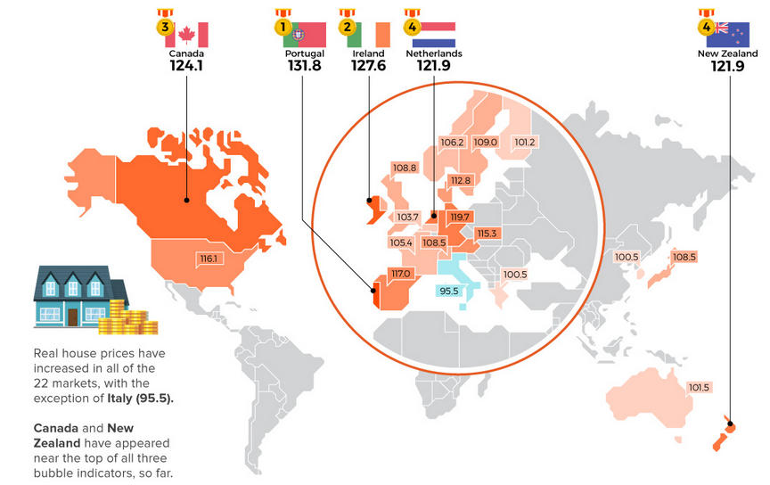
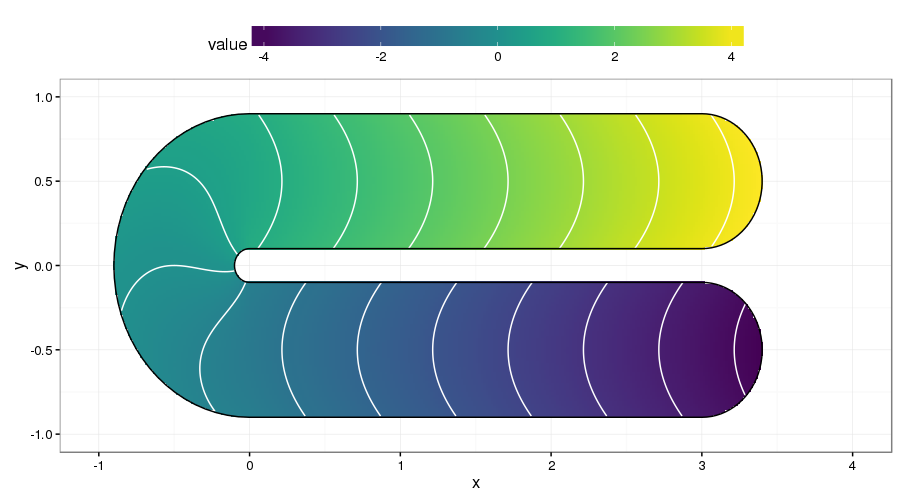

```{r setup, include = FALSE}
# general options --------------------------------------------------------------
options(scipen = 999)
set.seed(123)

# chunk options ----------------------------------------------------------------
knitr::opts_chunk$set(
  cache.extra = knitr::rand_seed, 
  message = FALSE, 
  warning = FALSE, 
  error = FALSE, 
  echo = FALSE,
  cache = TRUE,
  comment = "", 
  fig.align = "center", 
  fig.retina = 3
  )

# libraries --------------------------------------------------------------------
library(tidyverse)
library(fontawesome)
library(magrittr)
library(osmdata)
library(sf)
library(sp)
library(mgcv)
library(anicon)

# sources ----------------------------------------------------------------------
source(here::here("script/functions_project.R"))
source(here::here("script/osm_dublin_features.R"))
source(here::here("script/census_dublin_features.R"))

# data -------------------------------------------------------------------------
data_dublin_2018_features <- here::here("data/data_dublin_2018_features.rds") |>
  readr::read_rds()

n_final <- nrow(data_dublin_2018_features)

train_index <- sample(1:n_final, 0.8 * n_final)
test_index <- setdiff(1:n_final, train_index)

train_dublin_2018_features <- data_dublin_2018_features[train_index, ]
test_dublin_2018_features <- data_dublin_2018_features[test_index, ]
```

# My Journey into Data Science

#### Developement of the DynEmo Facial Expression Database (Master)

* Dynamic and spontaneous emotions
* Assessed with self-reports and by observers

#### Analysis of Emotional User Experience of Innovative Tech. (Industrial PhD)

* Understand users' acceptance of technologies from their emotional response
* Based on multivariate self-reports

#### Evaluation of Emotions from Facial and Physiological Measures (Industrial PostDoc)

* Applications to marketing, sports and automotive industries
* Dynamic changes with trend extraction techniques (2 patents)

#### Performance Prediction using Machine Learning (Academic PostDoc)

* Application to sport analytics
* Big Data treatment (> 1 million users with activities recorded in the past 5 years)

---
class: inverse, mline, center, middle

# 1. A Closer Look at Property Prices

---

# Market Characteristics

An housing market is endemic to a country in a specific context.

.pull-left[
Countries are very different in term of:
- Architecture Styles/Composition
- Building Materials
- Legislation
- Urban features
- Population characteristics
]

.pull-right[
```{r out.width = "100%"}

```
.center.tiny[Ratio of Housing prices adjusted for inflation (base year 2015)<br />Credit:  Jeff Desjardins - Visual Capitalist (2019) [`r emo::ji("link")`](https://www.visualcapitalist.com/mapped-the-countries-with-the-highest-housing-bubble-risks/)]
]

Ireland can be considered as a housing bubble as it has one of the highest ratio of Housing prices adjusted for inflation in the world.

Almost 40% of Irish population leave in greater Dublin (1.9M/4.9M inhabitant) spread on a 318 km2 urban area resulting in one of the lowest population density in an European capital (4,811 inhabitant/km2).

---

# Market History

Housing prices are included in an economic context. Despite, having one of European highest economic growth (5.5% in 2019), Ireland suffered badly form the economic crash between 2008 and 2012.

```{r fig.width=12, fig.height=5}
data_dublin_all_years <- here::here() |> dirname() |> dirname() |> 
  file.path("data/property_price_ireland_data/data_dublin_geocoded_clean.rds") |> 
  readr::read_rds() |>
  dplyr::mutate(year_fact = as.factor(as.character(year)))

avg_increase <- data_dublin_all_years |> 
  dplyr::group_by(year) |> 
  dplyr::summarise(m_price = mean(price)) |> 
  dplyr::ungroup() |> 
  dplyr::mutate(m_diff = m_price - lag(m_price)) |> 
  dplyr::mutate(percent_increase = m_diff/lag(m_price)) |> 
  dplyr::filter(year > 2012) |> 
  dplyr::summarise(m_increase = mean(percent_increase) |> scales::percent()) |> 
  dplyr::pull(m_increase)

data_dublin_all_years |> 
  ggplot(aes(x = year, y = price)) +
  geom_boxplot(aes(group = year)) +
  geom_smooth(method = "gam", formula = y ~ s(x, bs = "cs", k = 8)) +
  scale_y_continuous("Price", labels = scales::dollar_format(suffix = "", prefix = "€")) +
  scale_x_continuous("Sale Year", n.breaks = 8) + 
  theme_minimal() +
  theme(text = element_text(size = 14))
```
.center.tiny[Distribution of properties sold in Dublin's area between  2010 and 2018]

But since 2013, price have constantly risen with an average of `r avg_increase` leading to a social crisis in Dublin where the number of homeless people has gone to the roof.

---

# A Data Science Insight

All properties purchased has to be published online on the [Property Price Register](https://propertypriceregister.ie):

- Since January 2010
- Filed by the owners
- Contains only the address and the price

In its current form, the property price register is only used by buyers to compare the price of their future acquisition with the price that houses has be sold in the same street.  
 
However it could also be used to have an overall view of the price distribution by geocoding the addresses using sing [Nominatim REST API from Open Street Map](http://nominatim.openstreetmap.org):

```{r echo=TRUE, eval=FALSE}
address <- "10 Downing St, Westminster, London SW1A 2AA, United Kingdom"
api_url <- "http://nominatim.openstreetmap.org/search/@addr@?format=json&addressdetails=0&limit=1"

api_url |> 
  stringr::str_replace("\\@addr\\@", stringr::str_replace(address, "\\s+", "\\%20")) |> 
  jsonlite::fromJSON() |>
  dplyr::select(lat, lon)
#           lat                  lon
# 1 51.50344025 -0.12770820958562096
```

---

# Spatial Density with GAM

Once the lat/lon has been obtained, it is possible to estimate the typical property price in a 2D space:
- Use of Generalized Additive Model (GAM, see [Wood, 2017](Generalized additive models: An introduction with R))
- Application of a soap film smoother to solve the "finite area smoothing" problem due to the coastal shape of Dublin's area

```{r out.width="60%"}

```
.center.tiny[Illustration of the "finite area smoothing" problem.<br />Credit: Gavin Simpson (2016) [`r emo::ji("link")`](https://fromthebottomoftheheap.net/2016/03/27/soap-film-smoothers/)]

---

# Spatial Density with GAM

```{r}
# data -------------------------------------------------------------------------
dublin_multipol <- readr::read_rds(here::here("data/dublin_multipol.rds"))

dublin_sea <- dublin_multipol[[1]][[2]] |> 
  st_polygon() |> 
  st_geometry()
st_crs(dublin_sea) <- 4326

# bound ------------------------------------------------------------------------
gam_boundaries <- dublin_multipol[[1]][[1]][[1]]

bound <- list(
  list(
    x = gam_boundaries[,1], 
    y = gam_boundaries[,2], 
    f = rep(0, nrow(gam_boundaries))
  )
)

# knots ------------------------------------------------------------------------
bb <- readr::read_rds(here::here("data/bb.rds"))

bound.grid.lng <- seq(from = bb[1], to = bb[3], len = 10)
bound.grid.lat<- seq(from = bb[2], to = bb[4], len = 10)

bound.grid.map <- expand.grid(
  lng = bound.grid.lng, 
  lat = bound.grid.lat
)

names(bound.grid.map) <- c("x","y")

knots <- bound.grid.map[with(bound.grid.map, inSide(bound, x, y)), ]

names(knots) <- c("lng", "lat")
names(bound[[1]]) <- c("lng", "lat", "f")

dublin_sea_frame <- dublin_multipol[[1]][[2]]

knots$pb <- apply(knots, 1, function(row) {  
  sf::st_is_within_distance(
    dublin_sea_frame,
    sf::st_point(c(row["lng"],row["lat"])),
    dist = 0.001
  ) |> 
    as.numeric()
})

knots_pb <- knots |>
  dplyr::filter(pb == 1)

knots <- dplyr::anti_join(knots, knots_pb, by = c("lng", "lat"))
```

.pull-left[
**Step 1.** A matrix has to be drawn with key knots within the shape to predict
]

.pull-right[
```{r fig.height=2, fig.width=2}
ggplot() +
  geom_point(aes(knots$lng, knots$lat), color = "red") +
  geom_point(aes(bound[[1]]$lng, bound[[1]]$lat), na.rm = TRUE) +
  scale_x_continuous(limits = c(bb[1], bb[3])) +
  scale_y_continuous(limits = c(bb[2], bb[4])) +
  theme_void()
```
.center.tiny[Key knots within Dublin's coastal area.]
]

**Step 2.** A Bayesian spline smoothing using restricted maximum likelihood is applied to estimate the smoothness of the property price variation ([Wood, 2011](10.1111/j.1467-9868.2010.00749.x); [Lin & Zhang, 1999](10.1111/1467-9868.00183)):

```{r echo=TRUE}
gam_pred <- 
  mgcv::gam(
    price ~ s(lng, lat, bs = "so", xt = list(bnd = bound)), 
    data = data_dublin_2018_features, 
    method = "REML", 
    knots = knots,
    family = gaussian(link = "identity")
  ) |> 
  gam_density(too.far = 0.05, n.grid = 100)
```

---

# Spatial Density with GAM

```{r fig.height=6}
gam_pred |>
  dplyr::filter(value > 200000) |>
  ggplot(aes(x = lng, y = lat)) + 
  geom_raster(aes(fill = value), na.rm = TRUE) +
  geom_contour(aes(z = value), color = "black", na.rm = TRUE) +
  geom_sf(data = dublin_sea, fill = "light blue", inherit.aes = FALSE) +
  scale_fill_gradient(
    "Price Density", 
    low = '#3a53a4', 
    high = '#ed1c24', 
    breaks = c(250000, 600000), 
    labels = scales::dollar_format(suffix = "", prefix = "€"))  +
  scale_x_continuous(
    "Longitude", 
    limits = c(-6.5, -6), 
    breaks = seq(-6.5, -6, 0.2)) +
  scale_y_continuous(
    "Latitude", 
    limits = c(53.2, 53.5), 
    breaks = seq(53.2, 53.5, 0.1)) +
  theme_classic() +
  theme(
    text = element_text(size = 14),
    legend.position = "right",
    panel.background = element_rect(fill = "grey50")
  )
```

The prices differences between areas reveal that underlying factors are influencing these changes.

.center[**Can we predict the property prices with Urban and Socio-Economic features? and can we identify the most relevant features?**]

---
class: inverse, mline, center, middle

# 2. Urban and Socio-Economic Correlates

---

# Method

In order to predict the property prices with Urban and Socio-Economic features, a machine learning algorithm is used: XGBoost (https://xgboost.readthedocs.io).

> XGBoost is a decision-tree-based ensemble Machine Learning algorithm that uses a gradient boosting framework. In order to make the final prediction, the training continues iteratively, inserting new trees that predict the residuals or errors of previous trees that are then combined with previous trees. It's called gradient boosting since, when introducing new models, it uses a gradient descent algorithm to minimise the loss. 

> XGBoost is a great choice for a wide variety of real-world machine learning problems and is the most used for Kaggle Data Science Challenges (see [`r emo::ji("link")`](https://towardsdatascience.com/xgboost-lightgbm-and-other-kaggle-competition-favorites-6212e8b0e835))

The price of each property is related with:
- Its closest distance to each of 161 urban elements (e.g., bar, university, park, stadium, ...)
- Each of the 48 socio-economic characteristics of the geographic small where the property is situated

---
class: title-slide, middle

## Analysis 1: Urban Correlates

---

# Urban Correlates

Are property prices correlating with their distance to urban landmarks?

Calculation of shortest distance to each property GPS location with one of 160 urban features from the [Overpass API of Open Street Map](https://wiki.openstreetmap.org/wiki/Overpass_API).

For example, here is the query for all the pubs in Dublin:

.pull-left[

```{r exosmdata, echo=TRUE, eval=FALSE}
library(osmdata)

  opq("Dublin") |>
  add_osm_feature(
    key = "amenity",
    value = "pub"
  ) |>
  osmdata_sp() |>
  use_series("osm_points") |>
  plot()
```

]
.pull-right[

```{r ref.label="exosmdata", echo=FALSE, fig.dim=c(4, 4)}

```
.center.tiny[Location of results obtained from the query `amenity = pub` in Dublin using the R package {osmdata}.]
]

---

# Urban Correlates

Use these distances as predictors of the property price in a XGBoost model (tree based boosted regression, see [Chen & Guestrin, 2016](Generalized additive models: An introduction with R)). The dataset was randomly split in a train and in a test dataset (80% vs. 20%).

The results reveal that the **model explains 44% of the variance of the property prices** of the test dataset ...

```{r}
train_tbl_y <- train_dublin_2018_features |>
  dplyr::select(price) |>
  as.matrix()
train_tbl_x <- train_dublin_2018_features |>
  dplyr::select(any_of(osm_dublin_features)) |> 
  as.matrix()

test_tbl_y <- test_dublin_2018_features |>
  dplyr::select(price) |>
  as.matrix()
test_tbl_x <- test_dublin_2018_features |>
  dplyr::select(any_of(osm_dublin_features)) |> 
  as.matrix()

xgmodel <- 
  xgboost::xgboost(
    # https://xgboost.readthedocs.io/en/latest/parameter.html ------------------
    data = train_tbl_x,
    label = train_tbl_y,
    # Parameters for Tree Booster ----------------------------------------------
    booster = "gbtree",
    learning_rate = 0.3,
    min_split_loss = 0,
    max_depth = 6,
    min_child_weight = 1,
    max_delta_step = 0,
    subsample = 1,
    sampling_method = "uniform",
    colsample_bytree = 1,
    colsample_bylevel = 1,
    colsample_bynode = 1,
    reg_lambda = 1,
    reg_alpha = 0,
    tree_method = "auto", # Choices: auto, exact, approx, hist, gpu_hist
    refresh_leaf = 1,
    process_type = "default", # Choices: default, update
    grow_policy = "depthwise", # Choices: depthwise, lossguide
    max_leaves = 0,
    # Learning Task Parameters -------------------------------------------------
    objective = "reg:tweedie", 
    eval_metric = "rmse",
    base_score = 0.5,
    verbose = 0,
    nround = 100
  )

pred <- predict(xgmodel, test_tbl_x)

result <- data.frame(pred = pred, raw = test_tbl_y)
```

```{r fig.height=4}
result |>
  ggplot(aes(x = price, y = pred)) +
  geom_point(alpha = 0.1) +
  geom_smooth(
    method = "lm",
    fullrange = TRUE,
    se = TRUE,
    color = "black",
    size = 0.1,
    na.rm = TRUE
  ) +
  scale_x_continuous(
    "Property Price",
    labels = scales::dollar_format(suffix = "", prefix = "€")
  ) +
  scale_y_continuous(
    "Predicted Property Price",
    labels = scales::dollar_format(suffix = "", prefix = "€")
  ) +
  theme(text = element_text(size = 14)) +
  theme_classic()
```
.center.tiny[Model's prediction accuracy using urban features *vs.* test dataset.]

... but some features are more important than others!

---

# Urban Correlates

Identify the contributing importance of each feature to the property price estimate. 

This contribution (also called "importance") is a measure of the improvement in accuracy brought by a feature.

```{r results="asis"}
  xgboost::xgb.importance(model = xgmodel) |>
  dplyr::slice_head(n = 10) |>
  dplyr::arrange(desc(Gain)) |>
  dplyr::mutate(across(where(is.numeric), scales::percent, accuracy = 0.1)) |>
  dplyr::select(Feature, Importance = Gain) |>
  tidyr::separate(Feature, c("Feature Category", "Feature Type"), sep = "_") |>
  knitr::kable(format = "html", booktabs = TRUE, linesep = "") |>
  kableExtra::kable_styling(
    font_size = 14,
    full_width = TRUE,
    latex_options = "HOLD_position"
  ) |>
  kableExtra::column_spec(2, width = "10em")
```
.center.tiny[Top 10 most important feature according their contribution to the model.]

The proximity to **embassies** and **grasslands** is a driver of property prices.

---
class: title-slide, middle

## Analysis 2: Socio-economic Correlates

---

# Socio-economic Correlates

Is the distribution of population characteristics correlating with property prices?

Localisation of the properties within the "small area" (i.e. highest administrative resolution map) used for the [Irish Census 2016](https://www.cso.ie/en/). Each small area is summarised according a percentage of 48 socio-economic features (e.g. age, employment, civil status, religion, ...).

```{r out.width="60%"}
knitr::include_graphics("https://shanelynnwebsite-mid9n9g1q9y8tt.netdna-ssl.com/wp-content/uploads/2017/10/electoral-divisions-dublin-city-sapmap.png")
```
.center.tiny[Divisions of Dublin small areas.<br />Credit: Shane Lynn (2018) [`r emo::ji("link")`](https://www.shanelynn.ie/the-irish-property-price-register-geocoded-to-small-areas/)]

---

# Socio-economic Correlates

The census characteristics of the small area containing the properties are used as predictors of the property price in a XGBoost model. Again, the dataset was randomly split in a train and in a test dataset (80% vs. 20%).

The results reveal that **the 48 socio-economic features explain 42.8% of the property price variance** of the test dataset.

```{r}
train_tbl_y <- train_dublin_2018_features |>
  dplyr::select(price) |>
  as.matrix()
train_tbl_x <- train_dublin_2018_features |>
  dplyr::select(any_of(census_dublin_features)) |> 
  as.matrix()

test_tbl_y <- test_dublin_2018_features |>
  dplyr::select(price) |>
  as.matrix()
test_tbl_x <- test_dublin_2018_features |>
  dplyr::select(any_of(census_dublin_features)) |> 
  as.matrix()

xgmodel <- xgboost::xgboost(
  # https://xgboost.readthedocs.io/en/latest/parameter.html --------------------
  data = train_tbl_x,
  label = train_tbl_y,
  # Parameters for Tree Booster ------------------------------------------------
  booster = "gbtree",
  learning_rate = 0.3,
  min_split_loss = 0,
  max_depth = 6,
  min_child_weight = 1,
  max_delta_step = 0,
  subsample = 1,
  sampling_method = "uniform",
  colsample_bytree = 1,
  colsample_bylevel = 1,
  colsample_bynode = 1,
  reg_lambda = 1,
  reg_alpha = 0,
  tree_method = "auto", # Choices: auto, exact, approx, hist, gpu_hist
  refresh_leaf = 1,
  process_type = "default", # Choices: default, update
  grow_policy = "depthwise", # Choices: depthwise, lossguide
  max_leaves = 0,
  # Learning Task Parameters ---------------------------------------------------
  objective = "reg:gamma", 
  eval_metric = "rmse",
  base_score = 0.5,
  verbose = 0,
  nround = 100
)

pred <- predict(xgmodel, test_tbl_x)

result <- data.frame(pred = pred, raw = test_tbl_y)
```

```{r fig.height=4}
result |>
  ggplot(aes(x = price, y = pred)) +
  geom_point(alpha = 0.1) +
  geom_smooth(
    method = "lm",
    fullrange = TRUE,
    se = TRUE,
    color = "black",
    size = 0.1,
    na.rm = TRUE
  ) +
  scale_x_continuous(
    "Property Price",
    labels = scales::dollar_format(suffix = "", prefix = "€")
  ) +
  scale_y_continuous(
    "Predicted Property Price",
    labels = scales::dollar_format(suffix = "", prefix = "€")
  ) +
  theme(text = element_text(size = 14)) +
  theme_classic()
```
.center.tiny[Model's prediction accuracy using socio-economic features *vs.* test dataset.]

---

# Socio-economic Correlates

```{r results="asis"}
  xgboost::xgb.importance(model = xgmodel) |>
  dplyr::slice_head(n = 10) |>
  dplyr::arrange(desc(Gain)) |>
  dplyr::mutate_if(is.numeric, scales::percent, accuracy = 0.1) |>
  dplyr::mutate(
    `Feature Category` = case_when(
      Feature %in% carers ~ "carers",
      Feature %in% disabilty_age_group ~ "disabilty age group",
      Feature %in% general_health ~ "general health",
      Feature %in% housing_occupancy ~ "housing occupancy",
      Feature %in% housing_rooms ~ "housing rooms",
      Feature %in% housing_tenure ~ "housing tenure",
      Feature %in% housing_type ~ "housing type",
      Feature %in% population ~ "population",
      Feature %in% religion ~ "religion"
    )
  )  |> 
  dplyr::mutate(
    Feature = str_remove(Feature, "\\(Households\\)"),
    Feature = str_remove(Feature, "% "),
  ) |>
  dplyr::select(
    `Feature Category`,
    `Feature Type` = Feature,
    Importance = Gain
  ) |> 
  knitr::kable(format = "html", booktabs = TRUE, linesep = "") |>
  kableExtra::kable_styling(
    font_size = 14,
    full_width = TRUE,
    latex_options = "HOLD_position"
  ) |>
  kableExtra::column_spec(2, width = "20em")
```
.center.tiny[Top 10 most important feature according their contribution to the model.]

The **density of individual not providing regular unpaid personal help** in the area is the most important socio-economic feature to predict property prices. 

**Large properties** in the area and the proportion of **individuals reporting having no religion** are also relatively important.

---
class: inverse, mline, center, middle

# 3. Conclusion

---

# Conclusion

By preforming a feature analysis with urban and socio-economic features, it is possible to evaluate and predict the potential price of a property. 

--

- The presence of embassies or parks are criteria that influence significantly the price of properties.

--

- Similarly, the characteristics of inhabitants in the area such as religion, health and age is correlated to the evolution of housing prices. 

--

These results allow an understanding of why some areas have higher prices than others which is relevant information not only for real estate agents in charge of property valuations but also for buyers in order to estimate the real value of a property.

---

# Limitations and Perspectives

Still an ongoing work, more to follow in the coming weeks...

`r faa("exclamation-triangle", animate="flash", speed="slow", color="red")` Essential features haven't been taken into account:
- House characteristics (e.g., square meter size, number bedrooms, ...)
- Macroeconomic trends (e.g., economic growth, unemployment, ...)

`r faa("exclamation-triangle", animate="flash", speed="slow", color="red")` Essential features are difficult to assess:
- Market size
- Market demand 

A more global view is required to confirm the results:
- Full country perspective
- Comparison between cities

A temporal perspective would also be interesting to study


---

# Acknoledgment

Many thanks to the contributors and developers of the OpenStreetMap project.

.pull-left[
Many thanks to the developers and contributors of R and RStudio as well as to those of the packages used:
- {tidyverse}
- {magrittr}
- {mgcv}
- {xgboost}
- {OpenStreetMap}
- {osmdata}
- {rgdal}
- {sf}
- {sp}

... to name the main ones.
]
.pull-right[

More in "Geocomputation with R" (Lovelace, Nowosad, & Muenchow, 2021), a book on geographic data analysis, visualization and modelling.

```{r out.width = "50%"}
knitr::include_graphics("https://geocompr.robinlovelace.net/images/cover.png")
```
.center.tiny[Geocomputation with R.<br />Credit: Lovelace, Nowosad, & Muenchow (2021) [`r emo::ji("link")`](https://geocompr.robinlovelace.net)]
]

---
class: inverse, mline, left, middle


# Thanks for your attention, find me at...

[`r fa(name = "twitter")` @damien_dupre](http://twitter.com/damien_dupre)  
[`r fa(name = "github")` @damien-dupre](http://github.com/damien-dupre)  
[`r fa(name = "link")` damien-datasci-blog.netlify.app](https://damien-datasci-blog.netlify.app)  
[`r fa(name = "paper-plane")` damien.dupre@dcu.ie](mailto:damien.dupre@dcu.ie)